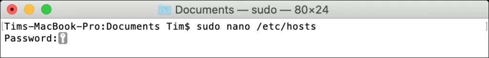

## Cách mở Terminal

Trên máy Mac của bạn, hãy thực hiện một trong các tác vụ sau:

- Bấm vào biểu tượng Launchpad  trên Dock, nhập Terminal vào trường tìm kiếm, sau đó bấm vào Terminal.
- Trong Finder , hãy mở thư mục /Ứng dụng/Tiện ích, sau đó bấm hai lần vào Terminal
- Nhấn tổ hợp phím **Command + Space** > Gõ **Terminal** > Nhấn **Return**.

## Các lệnh Terminal trên Mac liên quan đến thư mục

### Di chuyển đến thư mục muốn thao tác bằng lệnh `cd`

Bạn dùng lệnh `cd` để đổi đường dẫn thư mục. Ví dụ: `cd /Volumes/Elements/` để truy cập tới ổ đĩa ngoài tên là “Elements.”

Cấu trúc chung của lệnh di chuyển đến các thư mục là "**cd** + **Địa chỉ thư mục**". Bảng dưới đây tổng hợp một số lệnh mà bạn nên biết.

| **Lệnh với cd**      | **Thao tác tương ứng**                         |
| -------------------- | ---------------------------------------------- |
| cd [Địa chỉ thư mục] | Di chuyển đến thư mục được nhập                |
| cd ~                 | Di chuyển đến thư mục người dùng               |
| cd ./[Tên thư mục]   | Di chuyển đến thư mục con của thư mục hiện tại |
| cd ../               | Di chuyển về thư mục mẹ của thư mục hiện tại   |
| cd -                 | Di chuyển đến thư mục truy cập trước đó        |

### Liệt kê danh sách file, folder bằng lệnh `ls`

Lệnh này sẽ liệt kê toàn bộ file và folder có trong thư mục được chọn hoặc chỉ đơn giản gõ ls và Enter, lệnh sẽ liệt kê toàn bộ file và folder có trong thư mục hiện tại.

Bạn có thể thêm cờ (flags) vào lệnh ls để nhận được các kết quả khác nhau. Ví dụ: sử dụng -C để nhận kết quả nhiều cột, -S để sắp xếp theo kích thước, -lt để sắp xếp theo ngày sửa đổi, -la cho nội dung chi tiết bao gồm các tệp ẩn hoặc -lh để tạo danh sách với các kích thước tệp có thể đọc được.**3. Lệnh sao chép: cp**

**Ví dụ**: cp file.txt /destination/

Sử dụng cp để bắt đầu lệnh sao chép, thêm cờ nếu cần, sau đó nhập tệp hoặc thư mục đích, theo sau là dấu cách, sau đó thêm thư mục đích.Nếu bạn chỉ copy file, bạn có thể sử dụng lệnh cp mà không cần cờ như ví dụ ở hình trên. Nhưng nếu bạn muốn sao chép một thư mục, bạn sẽ cần sử dụng cờ -R để cho biết bạn muốn copy cả các file và folder trong thư mục con bên trong. Ví dụ: cp -R /folder/ /destination/. Bạn cũng có thể copy nhiều file trong một lệnh duy nhất. Ví dụ: cp file1.txt file2.txt file3.txt /destination/

**4. Di chuyển và đổi tên: mv**

**Ví dụ:** mv file.txt /destination/

Move hoạt động gần như giống như lệnh Copy ở trên, ngoại trừ việc không cần thêm cờ đệ quy khi di chuyển thư mục. Bạn có thể thêm cờ -i vào lệnh để yêu cầu xác nhận trước khi di chuyển vì lệnh mv mặc định sẽ ghi đè lên bất kỳ file nào trong thư mục đích

Bạn cũng có thể sử dụng mv để đổi tên file bằng cách “di chuyển” file vào cùng một thư mục. Ví dụ: mv oldfilename.txt newfilename.txt

**5. Tạo thư mục: mkdir**

**Ví dụ:** mkdir <name>

Có thể tạo nhiều thư mục cùng lúc bằng cách thêm dấu cách giữa các Folder. Ví dụ: mkdir folder1 folder2 folder3Nếu muốn tạo tên thư mục có khoảng trắng, chỉ cần để tên thư mục trong ngoặc kép, ví dụ: mkdir “my folder”

**6. Xóa Files & Folders: rm**

**Ví dụ:** rm <file>

Lệnh rm xóa các tệp hoặc thư mục ngay lập tức mà không yêu cầu bạn xác nhận trước. Bạn có thể thêm cờ -i để yêu cầu xác nhận của người dùng bất cứ khi nào sử dụng nó, điều này sẽ giúp ngăn ngừa rủi ro.Bạn có thể xóa nhiều file cùng một lúc bằng cách thêm nhiều tên file vào cuối lệnh. Ví dụ: rm file1.txt file2.txt file3.txt

**7. Hiển thị Disk Usage & Free Space: du & df**

**Ví dụ:** du /destination/

Sử dụng lệnh du để tính toán mức sử dụng đĩa ở vị trí được chỉ định. Để có một bản đọc hữu ích hơn, hãy chạy du -sh / destination /Tương tự, bạn có thể sử dụng df -h để tính dung lượng ổ đĩa hoặc sử dụng cờ -H để hiển thị tổng dung lượng ổ đĩa theo đơn vị lưu trữ “số liệu” (ví dụ: 1000MB mỗi GB thay vì 1024MB mỗi GB)

**8. Lệnh tìm File: find**

**Ví dụ:** find /location/ -name <file>

Lệnh này sẽ giúp bạn tìm file trên ổ cứng.

Bạn có thể sử dụng ký tự * để đại diện cho các ký tự tên file. Ví dụ: find /location/ -name ‘*.png’ để tìm các file có phần mở rộng là .PNG

**9. Lệnh mở file: open**

**Ví dụ:** open <file>

Bạn có thể dùng lệnh này để mở 1 hoặc nhiều file bằng cách gõ open và chỉ đường dẫn tới fileBạn cũng có thể chỉ định mở file bằng 1 ứng dụng cụ thể nào đó với cờ -a, theo sau là tên của ứng dụng (hoặc đường dẫn đến file .APP của ứng dụng nếu bạn biết). Ví dụ lệnh open -a Preview file.pdf sẽ mở file.pdf bằng trình Preview

**10. Lệnh Edit file: nano**

**Ví dụ:** nano <file>

nano là trình soạn thảo mã nguồn mở được tích hợp trong macOS để chỉnh sửa file ngay trong Terminal. Bạn có thể sửa các file văn bản, bao gồm cả các file hệ thống bằng cách gõ nano theo sau là đường dẫn tới fileỞ giao diện nano, hãy để ý tới các phím chức năng ở dưới màn hình, ví dụ **Control+O** là save và thoát, còn **Control X** sẽ là thoát mà không save

**11. Chạy bằng Super User: sudo**

**Ví dụ:** sudo <command>

Tiền tố sudo để thực thi một lệnh nào đó với tư cách là “Super User” (tức là root hoặc admin). Khi lệnh có tiền tố sudo, bạn sẽ được yêu cầu nhập mật khẩu admin.Khá nhiều lệnh yêu cầu quyền truy cập root để có thể thực thi, ví dụ edit file hosts như hình trên, bạn cần gõ sudo nano <file> để có thể thực thi

**12. Hiển thị đường dẫn thư mục hiện tại: pwd**

**Ví dụ:** pwd

Lệnh này sẽ hiển thị đường dẫn thư mục hiện tại bạn đang “đứng” trong Terminal, lệnh này khá hữu ích khi cần “in” ra đường dẫn thư mục để có thể hiện copy dùng cho mục đích nào đó.**13. Hiển thị các tiến trình (Process) đang chạy: top**

**Ví dụ:** top

Để xem danh sách các process hiện đang chạy cũng như dung lượng CPU và bộ nhớ mà chúng hiện đang sử dụng, chỉ cần gõ top. Mặc định, Process sẽ hiển thị theo mức độ sử dụng CPU, kèm theo id Process (PID).Nhấn Q để thoát sau khi đã xem được cái cần xem

**14. Terminate a Process: kill**

Ví dụ: kill <PID>

Bạn có thể sử dụng lệnh top ở trên để tìm PID, sau đó sử dụng Kill để chấm dứt Process đó, ví dụ: kill 3993**15. Tìm hiểu thêm về một command nào đó: man**

Ví dụ: man <command>

Mỗi lệnh sẽ có hướng dẫn đi kèm giải thích chính xác cách sử dụng và những cờ khác nhau kèm theo, cùng với một số ví dụ về các lệnh đang được sử dụng, man sẽ giúp bạn tìm hiểu kĩ hơn về lệnh đó. Ví dụ: lệnh top có rất nhiều cờ và các công cụ khác, bạn có thể đọc về cách sử dụng bằng cách gõ: man top. Nếu bạn muốn thành thạo dòng lệnh, việc sử dụng lệnh man là rất quan trọng.

Các lệnh trên rất quan trọng và hữu ích, đặc biệt khi phải làm việc trong chế độ Recovery. Nếu bạn là người thích vọc lệnh, bạn có thể làm được nhiều thứ hơn với Homebrew